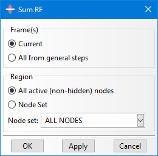

# Abaqus Plugin: Sum RF
Postprocessing-Plugin for Abaqus/CAE to calculate the sum of the reaction force from many nodes

 
More details:

This Plugin allows to sum the reaction forces of many nodes in postprocessing for every increment of each (active) general step. Afterwards xy-plots can be created from the generated curves, so you can see the evolution of the overall reaction force at a boundary condition, e.g.

This Plug-In isn’t really needed that often. Some time ago Abaqus/CAE was enhanced to include a “Sum” operator when you extract the xy-data from the Field Output. This built-in operation needs some more mouse clicks, but does the job more efficiently when the number of nodes is small (app. <10k). Beyond that my Plug-In is typically faster. I’m accessing the bulkDataBlocks of RF for the affected instances and use Numpy and Pythons izip-function (from itertools) to transform them into a dictionary. This is then quite fast to access. Still it might need a few seconds when you use it with a large number of nodes.

Additionally my Plug-In provides a fast and easy option to output the sum of reaction forces for the current frame only and it also provides two different methods for the magnitude calculation.

Other built-in alternatives are the usage of a coupling, in case you know the need already in preprocessing and a coupling is not affecting the behavior of the model. Also Report-> Field Output can sum data into the generated ASCII file.

See also the demo video in the media folder.

 

Usage at your own risk.